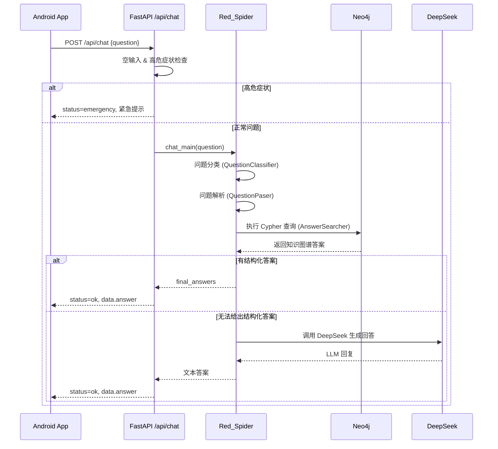

# 红蜘蛛AI医疗助手 - 架构总览

## 1. 总体架构

```mermaid
flowchart LR
  user[用户/Android App] -->|HTTP 请求| backendAPI[Backend API (FastAPI)]
  backendAPI -->|调用 chat_main()| redSpiderCore[RedSpiderCore]
  redSpiderCore -->|规则+知识图谱| neo4jDB[(Neo4j)]
  redSpiderCore -->|兜底调用| deepseekAPI[DeepSeek API]
```

- **用户侧**：Android App（`andriod_app/`）
  - 通过 Retrofit 调用 `POST /api/chat` 等接口
  - UI 展示聊天消息、加载状态、紧急提示

- **后端 API 层**：FastAPI（`backend/app/`）
  - `app/main.py`：应用入口，注册路由和健康检查
  - `app/api/chat.py`：聊天接口
  - `app/api/emergency.py`：紧急症状检测接口

- **业务核心**：红蜘蛛 V2 + DeepSeek（`red_spider_V2/Deepseek/robot.py`）
  - 问题分类（QuestionClassifier）
  - 问题解析（QuestionPaser）
  - 答案搜索（AnswerSearcher + Neo4j）
  - DeepSeek 兜底生成回答

- **数据层**：
  - Neo4j 医疗知识图谱（疾病-症状-药品-食物）
  - DeepSeek API（通过 OpenAI 兼容接口调用）

## 2. 请求处理流程

### 2.1 /api/chat 流程



## 3. 模块划分

### 3.1 后端（backend）

- `app/main.py`
  - 创建 FastAPI 应用实例
  - 注册路由（chat, emergency）
  - 注册 shutdown 事件，关闭 Neo4j 驱动

- `app/api/chat.py`
  - `/api/chat` 接口逻辑：
    - 参数校验
    - 高危症状关键词检查
    - 调用 `red_spider_service.chat_once`

- `app/api/emergency.py`
  - `/api/emergency/check` & `/batch-check` 接口
  - 直接使用 `utils/emergency.py` 中的检测逻辑

- `app/services/red_spider_service.py`
  - 负责导入并封装 `red_spider_V2/Deepseek/robot.py` 的 `Red_Spider` 类
  - 懒加载全局单例
  - 对外暴露 `chat_once(question)`

- `app/services/neo4j_client.py`
  - 统一的 Neo4j 访问层
  - `run_query`, `run_queries`, `test_connection`
  - 便于未来迁移到云端 Neo4j

- `app/services/deepseek_client.py`
  - DeepSeek API 封装
  - 超时、重试、错误处理

- `app/utils/`
  - `emergency.py`：高危症状检测 & 提示文案
  - `logger.py`：日志配置
  - `exceptions.py`：自定义异常

- `app/models/`
  - `ChatRequest`, `ChatResponse`, `ChatResponseData` 等 Pydantic 模型

### 3.2 Android App（andriod_app）

- `MainActivity.kt`
  - 聊天主界面
  - 消息列表（RecyclerView）
  - 输入框 + 发送按钮

- `ApiClient.kt`
  - Retrofit 封装
  - 调用 `/api/chat`

- `ChatAdapter.kt`
  - 消息 UI 类型：用户 / AI / 加载 / 错误 / 紧急

- `model/`
  - 对应后端请求/响应的数据类

### 3.3 Neo4j（neo4j）

- `cypher/create_schema.cql`
  - 索引和唯一约束

- `cypher/import_disease.cql`
  - 导入关系的示例（占位）

- `README.md`
  - 说明当前图来源与迁移步骤

## 4. 部署架构

### 4.1 Render 部署（backend）

- `render.yaml`（位于 `AI医疗助手/`）定义：
  - 服务类型：web
  - 运行环境：python
  - `rootDirectory: backend`
  - `buildCommand: pip install -r requirements.txt`
  - `startCommand: uvicorn app.main:app --host 0.0.0.0 --port $PORT`

- 环境变量：
  - `DEEPSEEK_API_KEY`
  - `NEO4J_URI`, `NEO4J_USER`, `NEO4J_PASSWORD`
  - `ENVIRONMENT=production`

### 4.2 Neo4j 部署

- 开发阶段：本地 Neo4j（localhost:7687）
- 生产阶段：建议使用 Neo4j Aura Free 或托管数据库
- 迁移步骤：
  1. 在新数据库执行 `create_schema.cql`
  2. 将数据导入（参考 `build_medicalgraph.py`）
  3. 在 Render 中更新 Neo4j 连接配置

## 5. 数据流与错误处理

- 所有接口使用统一响应结构 `ChatResponse`
- 后端日志：
  - 通过 `logger.py` 配置
  - 对 Neo4j、OpenAI/DeepSeek 等三方库降噪
- 错误分类：
  - 参数错误（如问题为空）
  - 内部错误（如 Neo4j 连接失败、Red_Spider 异常）
  - 外部 API 错误（DeepSeek 调用失败）

